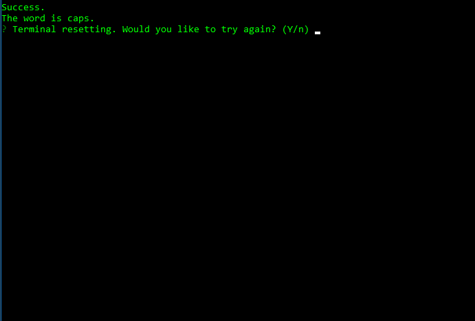

# Fallout Word Guess
-----------------------------

CLI word guess game with words from the Fallout video game series.

## Set up Fallout Word Guess
-----------------------------
**_Prerequisites_**
**In order to play Fallout Word Guess, ensure you have nodeJS installed.**
**Dependent node packages are listed in the package.json file.**

- Download files:
    - Download word-guess-cli from https://github.com/HillerDavid/word-guess-cli.
    

- Install node packages:
    - Open a terminal.
    - Navigate to word-guess-cli folder containing **index.js**.
    - Enter the command ```npm i```.

## How to play game
-----------------------------
**All commands should be entered looking in word-guess-cli folder in a terminal.**

### Launch game


### Guess a single letter

Correctly guessing a letter reveals it in the word blanks:


Incorrectly guessing a letter decreases remaining guesses by 1:


### Winning

Reveal all the letters in word to win:


### Losing

Running out of remaining guesses results in loss:


### Reset

When prompted to try again, enter `y`:



### Quit

When prompted to try again, enter `n`:

